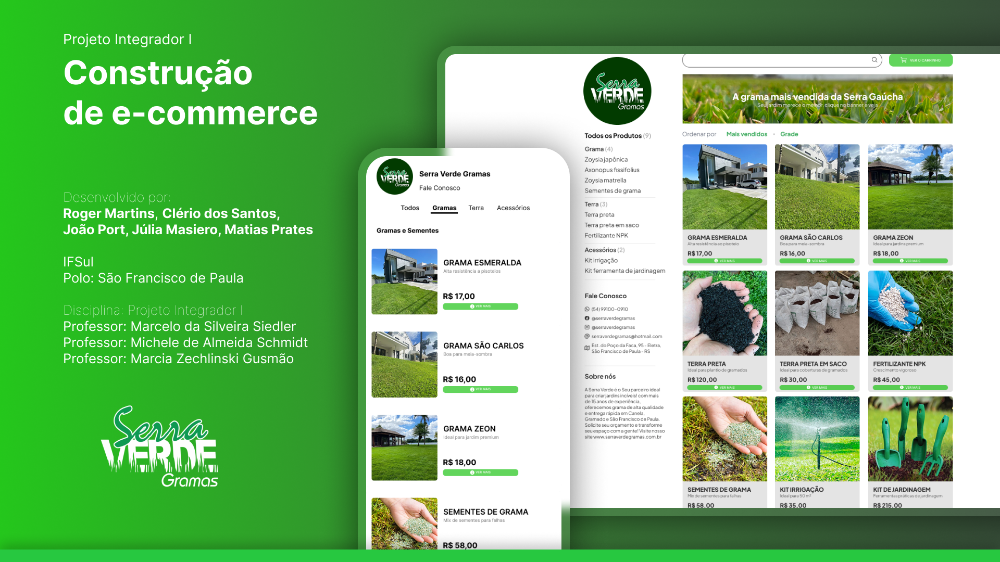

<h1 align="center">Serra Verde Gramas | E-commerce (Projeto Integrador III)</h1>

<p align="center">
  <a href="https://rogermorony.github.io/projeto-integrador-III/"><b>Visite o site</b></a>
</p>

<p align="center">
  
  
  
  
</p>

<p align="center">
  
</p>

---

## 📖 Sobre o Projeto

Este projeto faz parte da disciplina de **Projeto Integrador III** do curso de **Tecnologia em Sistemas para Internet — IFSul**.

O projeto consiste na evolução do front-end de um e-commerce fictício da **Serra Verde Gramas**, desenvolvido com HTML, CSS, JavaScript e Bootstrap.

Nesta etapa foram trabalhados conceitos de responsividade, componentes reutilizáveis, manipulação da DOM, armazenamento local de dados, validação de formulários, experiência do usuário (UX/UI) e acessibilidade.

O projeto continua em desenvolvimento e algumas funcionalidades estão planejadas para etapas futuras.

---

## 🚀 Funcionalidades Implementadas

- Catálogo dinâmico de produtos
- Páginas individuais de detalhes dos produtos
- Carrossel responsivo na página inicial
- Menu mobile responsivo
- Alternância entre Light Mode e Dark Mode
- Sistema de favoritar produtos
- Feedback visual ao adicionar produtos ao carrinho
- Cópia do link do produto
- Compartilhamento de produtos
  - WhatsApp
  - Facebook
  - E-mail
- Formulário de contato com validação
- Feedback dinâmico de erro e sucesso
- Persistência de dados utilizando LocalStorage
- Painel administrativo
- CRUD de categorias
  - Cadastro
  - Listagem
  - Edição
  - Exclusão
- Validação para impedir categorias duplicadas
- Proteção contra exclusão de categorias vinculadas a produtos

---

## 📌 Páginas do Projeto

### Página Inicial

`index.html`

- Carrossel de imagens
- Campo de busca
- Catálogo de produtos
- Navegação por categorias
- Sidebar em desktop
- Menu adaptado para dispositivos móveis

### Detalhes dos Produtos

`detalhes-*.html`

- Nome, imagem, descrição e preço
- Produtos relacionados
- Favoritar produto
- Copiar link
- Compartilhar produto
- Feedback visual das ações realizadas

### Contato

`contato.html`

- Formulário de contato
- Validação dos campos
- Feedback de erro e sucesso
- Campos obrigatórios e tipos adequados

### Painel Administrativo

`admin/index.html`

Área destinada ao gerenciamento do conteúdo da aplicação.

Atualmente está disponível o gerenciamento de categorias. Os módulos de gerenciamento de produtos e mensagens estão previstos para etapas futuras do projeto.

### Gerenciamento de Categorias

`admin/categorias.html`

- Cadastro de categorias
- Listagem
- Edição
- Exclusão
- Ativação e desativação
- Persistência utilizando LocalStorage
- Validação de categorias duplicadas
- Verificação de produtos vinculados antes da exclusão

---

## 🎨 Tecnologias Utilizadas

- **HTML5**
- **CSS3**
- **JavaScript (ES6)**
- **Bootstrap 5.3.3**
- **LocalStorage**
- **Google Fonts**
- **Ionicons**

---

## 🧠 Conceitos Aplicados

- HTML semântico
- Design responsivo
- Bootstrap Grid
- Componentes Bootstrap
- Manipulação da DOM
- Eventos JavaScript
- Manipulação de atributos e classes
- Validação de formulários
- Renderização dinâmica de conteúdo
- JSON
- LocalStorage
- CRUD no front-end
- Componentização de elementos da interface
- Feedback visual de ações
- UX/UI
- Princípios de acessibilidade para interfaces web

---

## ♿ Acessibilidade e UX/UI

Durante o desenvolvimento foram aplicadas melhorias voltadas à experiência do usuário e à acessibilidade, incluindo:

- Hierarquia semântica de títulos
- Associação entre `label` e campos de formulário
- Uso de atributos `aria-label`
- Uso de `aria-hidden` em elementos decorativos
- Uso de `aria-live` para mensagens dinâmicas
- Uso de `aria-pressed` em controles com estado
- Indicação visual de foco para navegação por teclado
- Feedback visual de sucesso e erro
- Navegação responsiva
- Identificação acessível de ações administrativas
- Suporte aos modos claro e escuro

---

## 📱 Responsividade

A interface foi desenvolvida para adaptação a diferentes tamanhos de tela.

O projeto utiliza recursos do **Bootstrap** em conjunto com media queries personalizadas para adaptar:

- Navegação
- Menu mobile
- Catálogo e cards
- Páginas de detalhes
- Formulário de contato
- Painel administrativo
- Rodapé

---

## 💾 Armazenamento de Dados

O projeto utiliza **LocalStorage** para persistência local dos dados utilizados pela aplicação.

Os dados são manipulados em JavaScript e armazenados em formato JSON.

Atualmente são utilizadas estruturas para:

- Categorias
- Produtos
- Mensagens

O CRUD de categorias utiliza essa camada de armazenamento para cadastrar, consultar, atualizar e excluir registros diretamente no navegador.

---

## 📂 Estrutura do Projeto

```text
projeto-integrador-III/
│
├── admin/
│   ├── index.html
│   └── categorias.html
│
├── src/
│   ├── assets/
│   ├── components/
│   │   ├── compartilhar.html
│   │   └── menu-mobile.html
│   │
│   ├── css/
│   │   ├── darkmode.css
│   │   ├── globals.css
│   │   ├── reset.css
│   │   └── responsividade.css
│   │
│   └── js/
│       ├── admin-categorias.js
│       ├── catalogo.js
│       ├── compartilhar.js
│       ├── dados.js
│       ├── main.js
│       ├── menu-mobile.js
│       └── storage.js
│
├── index.html
├── contato.html
├── carrinho.html
├── detalhes-*.html
└── README.md
```

---

## 🧭 Padrões de Interface

- Layout baseado em cards
- Grid responsivo
- Navegação lateral em desktop
- Menu específico para dispositivos móveis
- Interface adaptável a diferentes resoluções
- Feedback visual para ações do usuário
- Componentes reutilizáveis
- Uso de ícones com Ionicons
- Light Mode e Dark Mode

---

## 🔧 Funcionalidades Futuras

O projeto foi estruturado para permitir sua evolução nas próximas etapas.

Entre as funcionalidades previstas estão:

- Gerenciamento de produtos pelo painel administrativo
- Gerenciamento das mensagens recebidas
- Evolução do carrinho de compras
- Expansão das funcionalidades administrativas
- Integração com recursos de back-end em etapas futuras

---

## 👥 Equipe

**Desenvolvido por:**  
Roger Martins, Clério dos Santos, João Port, Júlia Masiero e Matias Prates

**IFSul — Polo:** São Francisco de Paula

**Professor:**

- Flávio Nunes

---

## 📌 Status do Projeto

O **Projeto Integrador III** encontra-se em desenvolvimento.

A versão atual concentra-se na evolução do front-end, responsividade, interatividade, persistência local de dados, UX/UI e acessibilidade. Funcionalidades adicionais estão previstas para as próximas etapas do projeto.